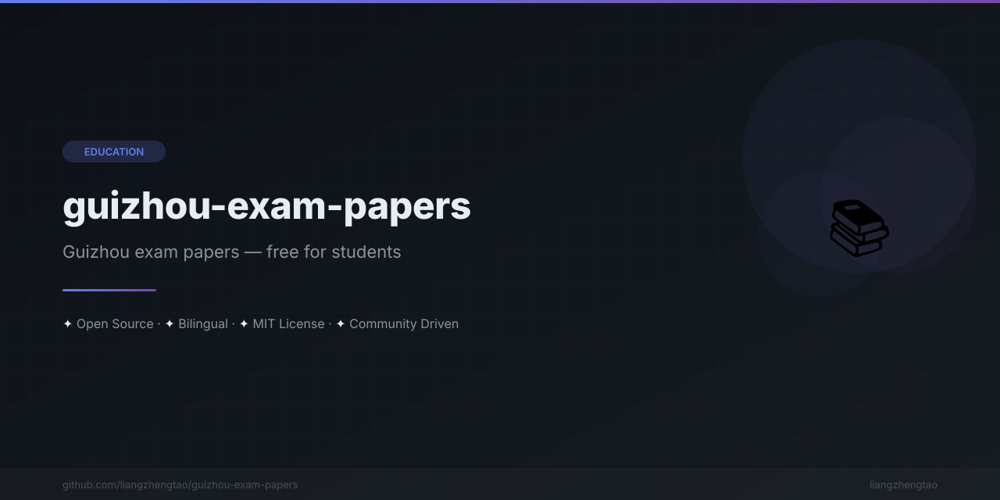

[中文版](README.zh.md)
n<div align="center">



</div>


<div align="center">

# Guizhou Exam Papers Collection

**Free collection of Guizhou/Guangxi high school mock exam papers and study guides for college entrance exam preparation**

[](LICENSE)

</div>

---

## What's Included

| Category | Content |
|----------|---------|
| Exam Papers | 17 papers (34 PDF files) across Physics, Math, Chemistry, and English |
| Study Guides | Subject-by-subject preparation guides with key topics and problem-solving techniques |
| Formula Sheets | Quick-reference sheets for Physics formulas, Math formulas, and Chemistry equations |

## Stats

| Metric | Value |
|--------|-------|
| Total papers | **17** (34 PDF files, continuously updated) |
| Subjects | **4** — Physics, Math, Chemistry, English |
| Year range | **2022 — 2026** |
| Levels | Grade 12 mock exams (1st/2nd/3rd mock) + Grade 9 middle school exam papers |
| Regions | Guizhou (Guiyang), Guangxi (Guilin / Hechi) |

## How to Use

1. Browse the paper tables below (organized by subject)
2. Click a paper link to download the PDF
3. Click the answer link to check your work
4. Check the Study Guides and Formula Sheets for review

> **Note:** Content is primarily in Chinese. This collection is designed for Chinese students preparing for the Gaokao (college entrance exam) and Zhongkao (middle school exam).

## Contributing

We welcome PRs to add exam papers! Please follow the naming convention:

```
{grade}/{subject}/{year}年{region}{type}{subject}试卷.pdf
{grade}/{subject}/{year}年{region}{type}{subject}试卷（答案）.pdf
```

## License

This project is licensed under the [MIT License](LICENSE).
